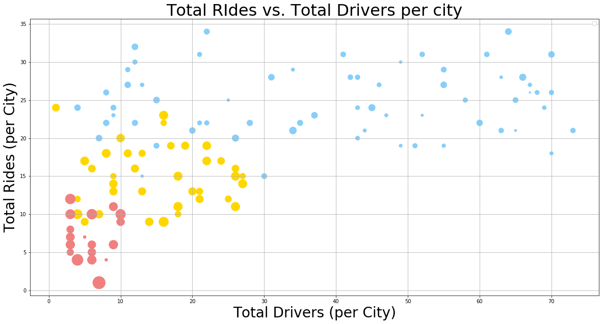
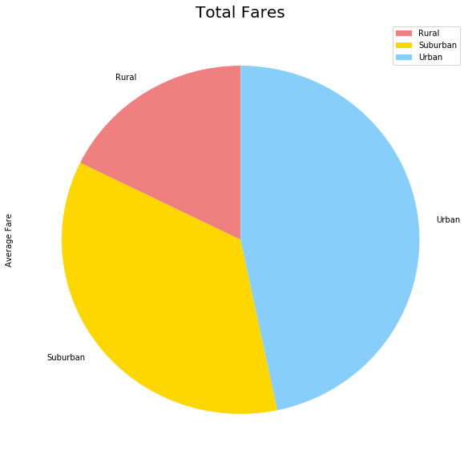
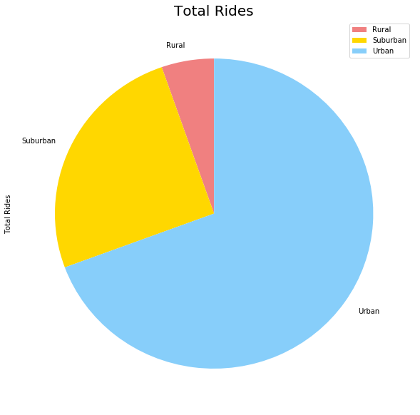
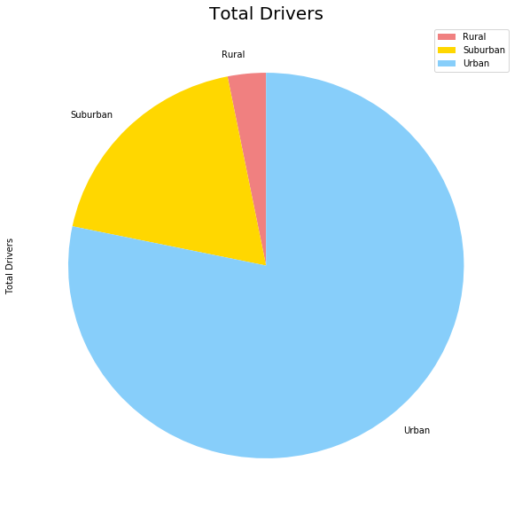

```python
# Dependencies
import matplotlib.pyplot as plt
import numpy as np
import pandas as pd
```


```python
#Read in csv
path_city = pd.read_csv("raw_data/city_data.csv")
path_ride = pd.read_csv("raw_data/ride_data.csv")

```


```python
path_ride.head()
```


<div>
<style scoped>
    .dataframe tbody tr th:only-of-type {
        vertical-align: middle;
    }

    .dataframe tbody tr th {
        vertical-align: top;
    }

    .dataframe thead th {
        text-align: right;
    }
</style>
<table border="1" class="dataframe">
  <thead>
    <tr style="text-align: right;">
      <th></th>
      <th>city</th>
      <th>date</th>
      <th>fare</th>
      <th>ride_id</th>
    </tr>
  </thead>
  <tbody>
    <tr>
      <th>0</th>
      <td>Sarabury</td>
      <td>2016-01-16 13:49:27</td>
      <td>38.35</td>
      <td>5403689035038</td>
    </tr>
    <tr>
      <th>1</th>
      <td>South Roy</td>
      <td>2016-01-02 18:42:34</td>
      <td>17.49</td>
      <td>4036272335942</td>
    </tr>
    <tr>
      <th>2</th>
      <td>Wiseborough</td>
      <td>2016-01-21 17:35:29</td>
      <td>44.18</td>
      <td>3645042422587</td>
    </tr>
    <tr>
      <th>3</th>
      <td>Spencertown</td>
      <td>2016-07-31 14:53:22</td>
      <td>6.87</td>
      <td>2242596575892</td>
    </tr>
    <tr>
      <th>4</th>
      <td>Nguyenbury</td>
      <td>2016-07-09 04:42:44</td>
      <td>6.28</td>
      <td>1543057793673</td>
    </tr>
  </tbody>
</table>
</div>


```python
path_city.head()
```


<div>
<style scoped>
    .dataframe tbody tr th:only-of-type {
        vertical-align: middle;
    }

    .dataframe tbody tr th {
        vertical-align: top;
    }

    .dataframe thead th {
        text-align: right;
    }
</style>
<table border="1" class="dataframe">
  <thead>
    <tr style="text-align: right;">
      <th></th>
      <th>city</th>
      <th>driver_count</th>
      <th>type</th>
    </tr>
  </thead>
  <tbody>
    <tr>
      <th>0</th>
      <td>Kelseyland</td>
      <td>63</td>
      <td>Urban</td>
    </tr>
    <tr>
      <th>1</th>
      <td>Nguyenbury</td>
      <td>8</td>
      <td>Urban</td>
    </tr>
    <tr>
      <th>2</th>
      <td>East Douglas</td>
      <td>12</td>
      <td>Urban</td>
    </tr>
    <tr>
      <th>3</th>
      <td>West Dawnfurt</td>
      <td>34</td>
      <td>Urban</td>
    </tr>
    <tr>
      <th>4</th>
      <td>Rodriguezburgh</td>
      <td>52</td>
      <td>Urban</td>
    </tr>
  </tbody>
</table>
</div>


```python
#CLEANING: 
#checked path_ride to find value counts (inconclusive)
#checked count & dtype (good)
#find and replace null values? 
#checked to find any values with 0 
```


```python
#check path_city to find value counts
path_city["city"].value_counts()
```


    Port James              2
    New Andreamouth         1
    Martinmouth             1
    New Jeffrey             1
    Sandymouth              1
    Anitamouth              1
    Port Guytown            1
    Zimmermanmouth          1
    North Tara              1
    Kennethburgh            1
    Prattfurt               1
    Pearsonberg             1
    Port Alexandria         1
    South Joseph            1
    Alyssaberg              1
    Kellershire             1
    Kimberlychester         1
    East Jenniferchester    1
    Williamshire            1
    Jeffreyton              1
    Port Samantha           1
    West Paulport           1
    East Douglas            1
    Torresshire             1
    Port Johnstad           1
    Kelseyland              1
    Port Jose               1
    South Elizabethmouth    1
    Alvarezhaven            1
    Lake Stevenbury         1
                           ..
    Vickimouth              1
    West Dawnfurt           1
    South Roy               1
    South Louis             1
    Tiffanyton              1
    Horneland               1
    Campbellport            1
    Erikport                1
    Conwaymouth             1
    Rodriguezview           1
    New Michelleberg        1
    Paulfort                1
    South Bryanstad         1
    Sarahview               1
    Mooreview               1
    West Pamelaborough      1
    New Jessicamouth        1
    Yolandafurt             1
    East Leslie             1
    West Tony               1
    Davistown               1
    West Sydneyhaven        1
    Maryside                1
    East Stephen            1
    Jacobfort               1
    New Brandonborough      1
    Travisville             1
    Webstertown             1
    Russellport             1
    Smithhaven              1
    Name: city, Length: 125, dtype: int64


```python
#colaps duplicate city "Port James" into one entry
path_city.loc[path_city['city'] == 'Port James']

```


<div>
<style scoped>
    .dataframe tbody tr th:only-of-type {
        vertical-align: middle;
    }

    .dataframe tbody tr th {
        vertical-align: top;
    }

    .dataframe thead th {
        text-align: right;
    }
</style>
<table border="1" class="dataframe">
  <thead>
    <tr style="text-align: right;">
      <th></th>
      <th>city</th>
      <th>driver_count</th>
      <th>type</th>
    </tr>
  </thead>
  <tbody>
    <tr>
      <th>84</th>
      <td>Port James</td>
      <td>15</td>
      <td>Suburban</td>
    </tr>
    <tr>
      <th>100</th>
      <td>Port James</td>
      <td>3</td>
      <td>Suburban</td>
    </tr>
  </tbody>
</table>
</div>


```python
#Port_James = pd.DataFrame(Port_James)
Port_James = pd.Series({"city":"Port_James", "driver_count":18, "type":"Suburban"})
```


```python
#drop rows with Port James in path_ride 
path_city = path_city[path_city.city != 'Port James']

#merge Port_James with path_ride
clean_city = path_city.append(Port_James, ignore_index=True)
clean_city.head()
```


<div>
<style scoped>
    .dataframe tbody tr th:only-of-type {
        vertical-align: middle;
    }

    .dataframe tbody tr th {
        vertical-align: top;
    }

    .dataframe thead th {
        text-align: right;
    }
</style>
<table border="1" class="dataframe">
  <thead>
    <tr style="text-align: right;">
      <th></th>
      <th>city</th>
      <th>driver_count</th>
      <th>type</th>
    </tr>
  </thead>
  <tbody>
    <tr>
      <th>0</th>
      <td>Kelseyland</td>
      <td>63</td>
      <td>Urban</td>
    </tr>
    <tr>
      <th>1</th>
      <td>Nguyenbury</td>
      <td>8</td>
      <td>Urban</td>
    </tr>
    <tr>
      <th>2</th>
      <td>East Douglas</td>
      <td>12</td>
      <td>Urban</td>
    </tr>
    <tr>
      <th>3</th>
      <td>West Dawnfurt</td>
      <td>34</td>
      <td>Urban</td>
    </tr>
    <tr>
      <th>4</th>
      <td>Rodriguezburgh</td>
      <td>52</td>
      <td>Urban</td>
    </tr>
  </tbody>
</table>
</div>


```python
#find average fare per city
fare = path_ride.groupby("city").mean()
fare = fare.rename(columns= {"fare":"Average Fare"})
fare = fare.reset_index()
fare
```


<div>
<style scoped>
    .dataframe tbody tr th:only-of-type {
        vertical-align: middle;
    }

    .dataframe tbody tr th {
        vertical-align: top;
    }

    .dataframe thead th {
        text-align: right;
    }
</style>
<table border="1" class="dataframe">
  <thead>
    <tr style="text-align: right;">
      <th></th>
      <th>city</th>
      <th>Average Fare</th>
      <th>ride_id</th>
    </tr>
  </thead>
  <tbody>
    <tr>
      <th>0</th>
      <td>Alvarezhaven</td>
      <td>23.928710</td>
      <td>5.351586e+12</td>
    </tr>
    <tr>
      <th>1</th>
      <td>Alyssaberg</td>
      <td>20.609615</td>
      <td>3.536678e+12</td>
    </tr>
    <tr>
      <th>2</th>
      <td>Anitamouth</td>
      <td>37.315556</td>
      <td>4.195870e+12</td>
    </tr>
    <tr>
      <th>3</th>
      <td>Antoniomouth</td>
      <td>23.625000</td>
      <td>5.086800e+12</td>
    </tr>
    <tr>
      <th>4</th>
      <td>Aprilchester</td>
      <td>21.981579</td>
      <td>4.574788e+12</td>
    </tr>
    <tr>
      <th>5</th>
      <td>Arnoldview</td>
      <td>25.106452</td>
      <td>5.021952e+12</td>
    </tr>
    <tr>
      <th>6</th>
      <td>Campbellport</td>
      <td>33.711333</td>
      <td>5.805424e+12</td>
    </tr>
    <tr>
      <th>7</th>
      <td>Carrollbury</td>
      <td>36.606000</td>
      <td>4.274615e+12</td>
    </tr>
    <tr>
      <th>8</th>
      <td>Carrollfort</td>
      <td>25.395517</td>
      <td>4.759008e+12</td>
    </tr>
    <tr>
      <th>9</th>
      <td>Clarkstad</td>
      <td>31.051667</td>
      <td>6.682745e+12</td>
    </tr>
    <tr>
      <th>10</th>
      <td>Conwaymouth</td>
      <td>34.591818</td>
      <td>4.391649e+12</td>
    </tr>
    <tr>
      <th>11</th>
      <td>Davidtown</td>
      <td>22.978095</td>
      <td>5.850005e+12</td>
    </tr>
    <tr>
      <th>12</th>
      <td>Davistown</td>
      <td>21.497200</td>
      <td>4.361977e+12</td>
    </tr>
    <tr>
      <th>13</th>
      <td>East Cherylfurt</td>
      <td>31.416154</td>
      <td>3.981187e+12</td>
    </tr>
    <tr>
      <th>14</th>
      <td>East Douglas</td>
      <td>26.169091</td>
      <td>4.732315e+12</td>
    </tr>
    <tr>
      <th>15</th>
      <td>East Erin</td>
      <td>24.478214</td>
      <td>5.226259e+12</td>
    </tr>
    <tr>
      <th>16</th>
      <td>East Jenniferchester</td>
      <td>32.599474</td>
      <td>5.933107e+12</td>
    </tr>
    <tr>
      <th>17</th>
      <td>East Leslie</td>
      <td>33.660909</td>
      <td>6.051052e+12</td>
    </tr>
    <tr>
      <th>18</th>
      <td>East Stephen</td>
      <td>39.053000</td>
      <td>5.306327e+12</td>
    </tr>
    <tr>
      <th>19</th>
      <td>East Troybury</td>
      <td>33.244286</td>
      <td>5.948234e+12</td>
    </tr>
    <tr>
      <th>20</th>
      <td>Edwardsbury</td>
      <td>26.876667</td>
      <td>5.296117e+12</td>
    </tr>
    <tr>
      <th>21</th>
      <td>Erikport</td>
      <td>30.043750</td>
      <td>6.883015e+12</td>
    </tr>
    <tr>
      <th>22</th>
      <td>Eriktown</td>
      <td>25.478947</td>
      <td>4.113171e+12</td>
    </tr>
    <tr>
      <th>23</th>
      <td>Floresberg</td>
      <td>32.310000</td>
      <td>2.630319e+12</td>
    </tr>
    <tr>
      <th>24</th>
      <td>Fosterside</td>
      <td>23.034583</td>
      <td>5.101131e+12</td>
    </tr>
    <tr>
      <th>25</th>
      <td>Hernandezshire</td>
      <td>32.002222</td>
      <td>5.206210e+12</td>
    </tr>
    <tr>
      <th>26</th>
      <td>Horneland</td>
      <td>21.482500</td>
      <td>5.351789e+12</td>
    </tr>
    <tr>
      <th>27</th>
      <td>Jacksonfort</td>
      <td>32.006667</td>
      <td>4.610855e+12</td>
    </tr>
    <tr>
      <th>28</th>
      <td>Jacobfort</td>
      <td>24.779355</td>
      <td>4.099091e+12</td>
    </tr>
    <tr>
      <th>29</th>
      <td>Jasonfort</td>
      <td>27.831667</td>
      <td>6.439182e+12</td>
    </tr>
    <tr>
      <th>...</th>
      <td>...</td>
      <td>...</td>
      <td>...</td>
    </tr>
    <tr>
      <th>95</th>
      <td>South Roy</td>
      <td>26.031364</td>
      <td>4.862249e+12</td>
    </tr>
    <tr>
      <th>96</th>
      <td>South Shannonborough</td>
      <td>26.516667</td>
      <td>4.824875e+12</td>
    </tr>
    <tr>
      <th>97</th>
      <td>Spencertown</td>
      <td>23.681154</td>
      <td>4.850559e+12</td>
    </tr>
    <tr>
      <th>98</th>
      <td>Stevensport</td>
      <td>31.948000</td>
      <td>3.125721e+12</td>
    </tr>
    <tr>
      <th>99</th>
      <td>Stewartview</td>
      <td>21.614000</td>
      <td>4.936695e+12</td>
    </tr>
    <tr>
      <th>100</th>
      <td>Swansonbury</td>
      <td>27.464706</td>
      <td>4.443028e+12</td>
    </tr>
    <tr>
      <th>101</th>
      <td>Thomastown</td>
      <td>30.308333</td>
      <td>4.525633e+12</td>
    </tr>
    <tr>
      <th>102</th>
      <td>Tiffanyton</td>
      <td>28.510000</td>
      <td>4.968458e+12</td>
    </tr>
    <tr>
      <th>103</th>
      <td>Torresshire</td>
      <td>24.207308</td>
      <td>5.117907e+12</td>
    </tr>
    <tr>
      <th>104</th>
      <td>Travisville</td>
      <td>27.220870</td>
      <td>3.317507e+12</td>
    </tr>
    <tr>
      <th>105</th>
      <td>Vickimouth</td>
      <td>21.474667</td>
      <td>4.242738e+12</td>
    </tr>
    <tr>
      <th>106</th>
      <td>Webstertown</td>
      <td>29.721250</td>
      <td>4.401465e+12</td>
    </tr>
    <tr>
      <th>107</th>
      <td>West Alexis</td>
      <td>19.523000</td>
      <td>5.133766e+12</td>
    </tr>
    <tr>
      <th>108</th>
      <td>West Brandy</td>
      <td>24.157667</td>
      <td>4.673435e+12</td>
    </tr>
    <tr>
      <th>109</th>
      <td>West Brittanyton</td>
      <td>25.436250</td>
      <td>5.796976e+12</td>
    </tr>
    <tr>
      <th>110</th>
      <td>West Dawnfurt</td>
      <td>22.330345</td>
      <td>5.119541e+12</td>
    </tr>
    <tr>
      <th>111</th>
      <td>West Evan</td>
      <td>27.013333</td>
      <td>5.445616e+12</td>
    </tr>
    <tr>
      <th>112</th>
      <td>West Jefferyfurt</td>
      <td>21.072857</td>
      <td>3.614437e+12</td>
    </tr>
    <tr>
      <th>113</th>
      <td>West Kevintown</td>
      <td>21.528571</td>
      <td>7.002171e+12</td>
    </tr>
    <tr>
      <th>114</th>
      <td>West Oscar</td>
      <td>24.280000</td>
      <td>4.525743e+12</td>
    </tr>
    <tr>
      <th>115</th>
      <td>West Pamelaborough</td>
      <td>33.799286</td>
      <td>4.081521e+12</td>
    </tr>
    <tr>
      <th>116</th>
      <td>West Paulport</td>
      <td>33.278235</td>
      <td>4.895520e+12</td>
    </tr>
    <tr>
      <th>117</th>
      <td>West Peter</td>
      <td>24.875484</td>
      <td>4.630766e+12</td>
    </tr>
    <tr>
      <th>118</th>
      <td>West Sydneyhaven</td>
      <td>22.368333</td>
      <td>4.432234e+12</td>
    </tr>
    <tr>
      <th>119</th>
      <td>West Tony</td>
      <td>29.609474</td>
      <td>5.080147e+12</td>
    </tr>
    <tr>
      <th>120</th>
      <td>Williamchester</td>
      <td>34.278182</td>
      <td>5.679295e+12</td>
    </tr>
    <tr>
      <th>121</th>
      <td>Williamshire</td>
      <td>26.990323</td>
      <td>4.937704e+12</td>
    </tr>
    <tr>
      <th>122</th>
      <td>Wiseborough</td>
      <td>22.676842</td>
      <td>6.046575e+12</td>
    </tr>
    <tr>
      <th>123</th>
      <td>Yolandafurt</td>
      <td>27.205500</td>
      <td>4.870867e+12</td>
    </tr>
    <tr>
      <th>124</th>
      <td>Zimmermanmouth</td>
      <td>28.301667</td>
      <td>4.618734e+12</td>
    </tr>
  </tbody>
</table>
<p>125 rows × 3 columns</p>
</div>


```python
#find number of rides per city
rides_total = path_ride["city"].value_counts()
rides_total = pd.DataFrame(rides_total)
rides_total = rides_total.reset_index()
rides_total = rides_total.rename(columns= {"index": "city", "city":"Total Rides"})
rides_total.head()
```


<div>
<style scoped>
    .dataframe tbody tr th:only-of-type {
        vertical-align: middle;
    }

    .dataframe tbody tr th {
        vertical-align: top;
    }

    .dataframe thead th {
        text-align: right;
    }
</style>
<table border="1" class="dataframe">
  <thead>
    <tr style="text-align: right;">
      <th></th>
      <th>city</th>
      <th>Total Rides</th>
    </tr>
  </thead>
  <tbody>
    <tr>
      <th>0</th>
      <td>Swansonbury</td>
      <td>34</td>
    </tr>
    <tr>
      <th>1</th>
      <td>Port Johnstad</td>
      <td>34</td>
    </tr>
    <tr>
      <th>2</th>
      <td>South Louis</td>
      <td>32</td>
    </tr>
    <tr>
      <th>3</th>
      <td>Port James</td>
      <td>32</td>
    </tr>
    <tr>
      <th>4</th>
      <td>Arnoldview</td>
      <td>31</td>
    </tr>
  </tbody>
</table>
</div>


```python
#find number of drivers per city
driver_count = path_city.groupby("city").sum()
driver_count = driver_count.rename(columns= {"driver_count": "Total Drivers"})
driver_count = driver_count.reset_index()
driver_count.head()
```


<div>
<style scoped>
    .dataframe tbody tr th:only-of-type {
        vertical-align: middle;
    }

    .dataframe tbody tr th {
        vertical-align: top;
    }

    .dataframe thead th {
        text-align: right;
    }
</style>
<table border="1" class="dataframe">
  <thead>
    <tr style="text-align: right;">
      <th></th>
      <th>city</th>
      <th>Total Drivers</th>
    </tr>
  </thead>
  <tbody>
    <tr>
      <th>0</th>
      <td>Alvarezhaven</td>
      <td>21</td>
    </tr>
    <tr>
      <th>1</th>
      <td>Alyssaberg</td>
      <td>67</td>
    </tr>
    <tr>
      <th>2</th>
      <td>Anitamouth</td>
      <td>16</td>
    </tr>
    <tr>
      <th>3</th>
      <td>Antoniomouth</td>
      <td>21</td>
    </tr>
    <tr>
      <th>4</th>
      <td>Aprilchester</td>
      <td>49</td>
    </tr>
  </tbody>
</table>
</div>


```python
#merge data frames together (clean_city & fare)
clean_city_fare = fare.merge(clean_city, on= "city")
# merge (rides_total & driver_count)
rides_total_driver_count = rides_total.merge(driver_count, on= "city")
rides_total_driver_count
clean_pyber = rides_total_driver_count.merge(clean_city_fare, on= "city")
clean_pyber.head()
```


<div>
<style scoped>
    .dataframe tbody tr th:only-of-type {
        vertical-align: middle;
    }

    .dataframe tbody tr th {
        vertical-align: top;
    }

    .dataframe thead th {
        text-align: right;
    }
</style>
<table border="1" class="dataframe">
  <thead>
    <tr style="text-align: right;">
      <th></th>
      <th>city</th>
      <th>Total Rides</th>
      <th>Total Drivers</th>
      <th>Average Fare</th>
      <th>ride_id</th>
      <th>driver_count</th>
      <th>type</th>
    </tr>
  </thead>
  <tbody>
    <tr>
      <th>0</th>
      <td>Swansonbury</td>
      <td>34</td>
      <td>64</td>
      <td>27.464706</td>
      <td>4.443028e+12</td>
      <td>64</td>
      <td>Urban</td>
    </tr>
    <tr>
      <th>1</th>
      <td>Port Johnstad</td>
      <td>34</td>
      <td>22</td>
      <td>25.882941</td>
      <td>4.853955e+12</td>
      <td>22</td>
      <td>Urban</td>
    </tr>
    <tr>
      <th>2</th>
      <td>South Louis</td>
      <td>32</td>
      <td>12</td>
      <td>27.087500</td>
      <td>5.788817e+12</td>
      <td>12</td>
      <td>Urban</td>
    </tr>
    <tr>
      <th>3</th>
      <td>Arnoldview</td>
      <td>31</td>
      <td>41</td>
      <td>25.106452</td>
      <td>5.021952e+12</td>
      <td>41</td>
      <td>Urban</td>
    </tr>
    <tr>
      <th>4</th>
      <td>Williamshire</td>
      <td>31</td>
      <td>70</td>
      <td>26.990323</td>
      <td>4.937704e+12</td>
      <td>70</td>
      <td>Urban</td>
    </tr>
  </tbody>
</table>
</div>


```python
#create  bubble chart
#set colors for 'type' values
colors = {'Urban' : 'lightskyblue',
          'Suburban' : 'gold',
          'Rural' : 'lightcoral'}
c = [colors[val] for val in clean_pyber['type']]

#create scatter plot
pyber_bubble = clean_pyber.plot(kind="scatter", x="Total Drivers", y="Total Rides", grid=True, figsize=(20,10), title="Total RIdes vs. Total Drivers per city", sizes=(clean_pyber['Average Fare']-20)*20, colors=c)

#set labels & title
pyber_bubble.set_xlabel("Total Drivers (per City)", fontsize=28)
pyber_bubble.set_ylabel("Total Rides (per City)", fontsize=28)
pyber_bubble.set_title(pyber_bubble.title.get_text(), fontsize=32)
#set legend
pyber_bubble.legend(["Total Drivers"], c)

plt.show()
```

    /Users/stefanirobnett/anaconda3/lib/python3.6/site-packages/pandas/plotting/_core.py:186: UserWarning: 'colors' is being deprecated. Please use 'color'instead of 'colors'
      warnings.warn(("'colors' is being deprecated. Please use 'color'"
    /Users/stefanirobnett/anaconda3/lib/python3.6/site-packages/matplotlib/collections.py:853: RuntimeWarning: invalid value encountered in sqrt
      scale = np.sqrt(self._sizes) * dpi / 72.0 * self._factor
    /Users/stefanirobnett/anaconda3/lib/python3.6/site-packages/matplotlib/legend.py:936: UserWarning: Legend does not support 'Total Drivers' instances.
    A proxy artist may be used instead.
    See: http://matplotlib.org/users/legend_guide.html#creating-artists-specifically-for-adding-to-the-legend-aka-proxy-artists
      "aka-proxy-artists".format(orig_handle)





```python
#group by type
clean_pyber_groupby = clean_pyber.groupby('type').sum()

clean_pyber_groupby.head()
```


<div>
<style scoped>
    .dataframe tbody tr th:only-of-type {
        vertical-align: middle;
    }

    .dataframe tbody tr th {
        vertical-align: top;
    }

    .dataframe thead th {
        text-align: right;
    }
</style>
<table border="1" class="dataframe">
  <thead>
    <tr style="text-align: right;">
      <th></th>
      <th>Total Rides</th>
      <th>Total Drivers</th>
      <th>Average Fare</th>
      <th>ride_id</th>
      <th>driver_count</th>
    </tr>
    <tr>
      <th>type</th>
      <th></th>
      <th></th>
      <th></th>
      <th></th>
      <th></th>
    </tr>
  </thead>
  <tbody>
    <tr>
      <th>Rural</th>
      <td>125</td>
      <td>104</td>
      <td>615.728572</td>
      <td>9.591028e+13</td>
      <td>104</td>
    </tr>
    <tr>
      <th>Suburban</th>
      <td>593</td>
      <td>620</td>
      <td>1236.820828</td>
      <td>1.930277e+14</td>
      <td>620</td>
    </tr>
    <tr>
      <th>Urban</th>
      <td>1625</td>
      <td>2607</td>
      <td>1623.863390</td>
      <td>3.203337e+14</td>
      <td>2607</td>
    </tr>
  </tbody>
</table>
</div>


```python
#Pie Chart % of Total Fares by City Type

#labels = clean_pyber_groupby['type']
#fare = clean_pyber_groupby['Average Fare']
c = ['lightcoral', 'gold', 'lightskyblue']
pyber_Total_Fares = clean_pyber_groupby.plot(kind='pie',y ='Average Fare', figsize=(10,10), startangle=90, colors=c)
pyber_Total_Fares.set_title('Total Fares', fontsize=20)
plt.show()

```





```python
#Pie Chart % of Total Rides by City Type
c = ['lightcoral', 'gold', 'lightskyblue']
pyber_Total_Rides = clean_pyber_groupby.plot(kind='pie',y ='Total Rides', figsize=(10,10), startangle=90, colors=c)
pyber_Total_Rides.set_title('Total Rides', fontsize=20)
plt.show()

```





```python
#Pie Chart % of Total Drivers by City Type
c = ['lightcoral', 'gold', 'lightskyblue']
pyber_Total_Drivers = clean_pyber_groupby.plot(kind='pie',y ='Total Drivers', figsize=(10,10), startangle=90, colors=c)
pyber_Total_Drivers.set_title('Total Drivers', fontsize=20)
plt.show()

```




